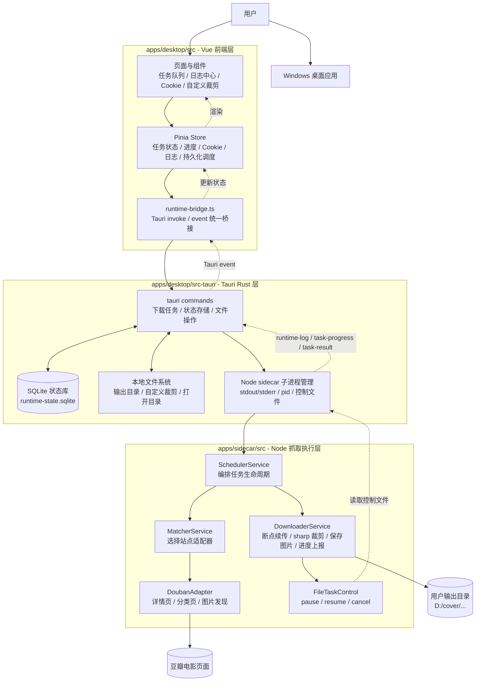
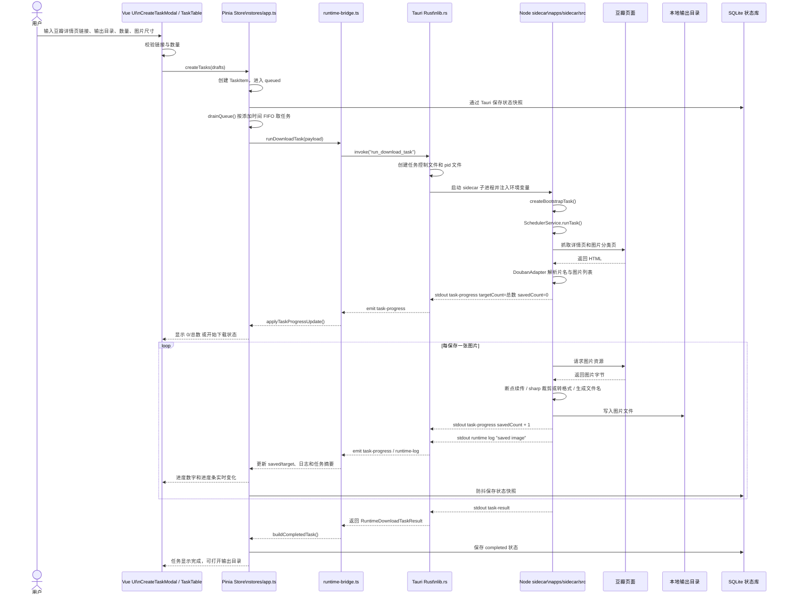

# Movie Cover Downloader

一个面向 Windows 的影视封面/剧照下载器桌面应用，当前只支持豆瓣电影。应用提供任务队列、Cookie 管理、实时下载进度、本地输出目录管理、自定义裁剪能力。

## 快速入口

- 使用说明：[docs/usage-guide.md](./docs/usage-guide.md)
- sidecar 说明：[apps/sidecar/README.md](./apps/sidecar/README.md)

## 当前定位

- 桌面壳：`Tauri 2`
- 前端：`Vue 3 + TypeScript + Vite + Pinia`
- 抓取执行层：`Node.js sidecar + TypeScript`
- 图片处理：`sharp`
- 本地状态存储：`SQLite`
- 目标平台：`Windows`

## 项目整体架构

```text
movie-cover-downloader/
├─ apps/
│  ├─ desktop/                 # 桌面端应用：Vue 前端 + Tauri Rust 命令层
│  │  ├─ src/                   # 前端 UI、状态管理、运行时桥接、表单校验
│  │  └─ src-tauri/             # Tauri 后端：SQLite、文件系统、sidecar 进程管理
│  └─ sidecar/                  # Node 抓取执行层：站点适配、图片发现、下载、裁剪
├─ docs/                        # 用户使用说明和安装包说明
├─ scripts/                     # 构建安装包前的 sidecar 资源准备脚本
├─ package.json                 # 工作区级脚本入口
└─ README.md                    # 当前文件
```

### 架构图



### 项目执行流程图



项目采用“三层协作”的结构：

1. `apps/desktop/src` 是用户界面层，负责表单、任务列表、日志中心、Cookie 管理、自定义裁剪和本地状态展示。
2. `apps/desktop/src-tauri/src/lib.rs` 是桌面能力层，负责 SQLite 持久化、打开/删除本地目录、读取本地图片、启动 Node sidecar、转发日志和进度事件。
3. `apps/sidecar/src` 是真实抓取执行层，负责解析豆瓣页面、发现图片、断点续传、图片裁剪/转格式、保存文件，并把结果通过 stdout 返回给 Tauri。

## 运行时数据流

### 新增链接下载任务

```text
用户在前端填写豆瓣链接
  ↓
CreateTaskModal 校验链接、数量、输出目录、图片尺寸
  ↓
Pinia store 创建 TaskItem，并启动队列 drainQueue
  ↓
runtime-bridge 调用 Tauri 命令 run_download_task
  ↓
Rust 创建任务控制文件，启动 Node sidecar 子进程
  ↓
sidecar 读取环境变量，构造 SidecarTask
  ↓
SchedulerService 调用 MatcherService / DoubanAdapter 发现图片
  ↓
DownloaderService 逐张下载、断点续传、裁剪或转格式、保存图片
  ↓
sidecar 输出 task-progress / runtime log / task-result
  ↓
Rust 解析 stdout，emit runtime-log 和 task-progress 给前端
  ↓
Pinia store 实时更新任务进度、状态、日志和本地持久化快照
```

### 实时进度机制

下载进度不是等任务结束后一次性计算，而是由 sidecar 在每张图片保存成功后输出 `task-progress` 事件。Rust 收到后发给前端，前端 store 更新 `download.savedCount` / `download.targetCount`，任务表格的进度文字和进度条随之变化。

为了提高可靠性，进度还有一条兜底路径：Rust 会把 `task-progress` 同步写成隐藏日志，前端如果收到日志批次，也能从日志中恢复进度状态。

### 暂停、继续、删除和清空队列

Tauri 和 sidecar 之间使用任务控制文件通信：

- 暂停任务：Rust 写入 `pause`，sidecar 在下载循环安全点抛出暂停错误。
- 继续任务：Rust 写入 `resume`，前端把任务重新放回队列。
- 删除/清空任务：Rust 写入 `cancel`，并尝试根据 pid 文件结束仍在运行的 sidecar 进程。

删除任务和清空队列时，Rust 会校验输出目录必须位于用户选择的输出根目录之内，避免误删输出根目录或其他本地文件。

## 主要模块分析

### 前端层：`apps/desktop/src`

- `main.ts`：Vue 应用入口，挂载 Pinia 和路由。
- `App.vue`：应用根组件，启动本地状态恢复。
- `layouts/AppShell.vue`：主布局，组合侧边栏、顶栏、弹窗和页面内容。
- `views/ControlCenterView.vue`：控制中心，展示任务队列和 Cookie 列表。
- `views/LogCenterView.vue`：日志中心，展示运行日志和错误过滤。
- `stores/app.ts`：核心状态仓库，管理任务队列、Cookie、日志、持久化、下载调度、暂停/继续/删除/清空等动作。
- `lib/runtime-bridge.ts`：前端与 Tauri 的统一桥接层；在浏览器预览模式下提供 localStorage 和 DOM 事件降级实现。
- `components/queue/CreateTaskModal.vue`：新增链接任务弹窗，负责链接、数量、输出目录、格式和图片比例配置。
- `components/queue/TaskTable.vue`：任务队列表格，负责分页、操作按钮、打开目录和删除确认。
- `components/queue/CustomCropModal.vue`：自定义裁剪弹窗，支持本地图片上传、拖拽、比例裁剪、缩放和保存。
- `components/logs/LogConsole.vue`：日志列表组件。
- `components/cookies/ImportCookieModal.vue`：Cookie 导入弹窗。

### Tauri 层：`apps/desktop/src-tauri`

- `main.rs`：Tauri 应用入口。
- `lib.rs`：桌面能力核心。它注册前端可调用命令，负责：
  - 读取/保存 SQLite 状态库；
  - 从旧 JSON 状态迁移到 SQLite；
  - 检测和恢复损坏状态库；
  - 启动 sidecar 子进程；
  - 解析 sidecar stdout/stderr；
  - 向前端转发日志和实时进度；
  - 打开目录、定位文件、删除输出目录；
  - 读取本地图片和保存自定义裁剪结果；
  - 管理任务控制文件和 pid 文件。

### sidecar 层：`apps/sidecar/src`

sidecar 是独立 Node 进程。它不直接操作前端状态，也不直接调用 Tauri API，只通过 stdout 输出结构化 JSON 给 Rust 解析。

核心职责包括：

- 从环境变量读取单次下载任务参数；
- 解析豆瓣详情页和图片分类页；
- 根据用户选择的剧照/海报/壁纸发现图片；
- 按限制数量或无限制模式返回图片列表；
- 下载图片并支持断点续传；
- 按用户选择保存原图、9:16 或 3:4；
- 使用 `sharp` 做裁剪和格式转换；
- 保存图片后立即上报实时进度；
- 识别暂停/取消控制文件并中止任务。

更细的 sidecar 目录说明见 [apps/sidecar/README.md](./apps/sidecar/README.md)。

## 本地持久化设计

应用状态保存在 Tauri 应用数据目录下的 `runtime-state.sqlite`，不保存在项目目录，也不会打进安装包。状态库主要保存：

- 任务队列；
- Cookie 列表；
- 日志列表；
- 队列配置。

前端仍以一个完整快照保存状态，Rust 层把快照拆分写入 SQLite 表。这样可以保持前端状态结构简单，同时减少单个 JSON 文件越来越大或损坏后难恢复的问题。

如果 SQLite 状态库损坏，Rust 会把主库和 WAL/SHM 文件备份成 `runtime-state.corrupt-*`，再创建干净状态库继续运行。

## 图片输出设计

用户选择的是输出根目录，例如：

```text
D:/cover
```

每个下载任务会在输出根目录下生成影片目录和分类目录，例如：

```text
D:/cover/让子弹飞 - 2026-05-02/still
D:/cover/让子弹飞 - 2026-05-02/poster
D:/cover/让子弹飞 - 2026-05-02/wallpaper
```

自定义裁剪图片固定保存到：

```text
D:/cover/custom-crop-photo
```

删除任务或清空队列时，只会删除任务生成的输出子目录。代码会拒绝删除输出根目录本身，也会拒绝删除输出根目录之外的路径。

## 构建与开发脚本

根目录常用脚本：

```bash
pnpm dev:web              # 启动前端网页预览
pnpm dev:desktop          # 启动 Tauri 桌面开发模式
pnpm build:web            # 构建前端，同时准备 sidecar bundle
pnpm build:desktop        # 构建 Windows 桌面安装包
pnpm build:sidecar        # 单独构建 sidecar
pnpm typecheck            # 前端类型检查
pnpm typecheck:sidecar    # sidecar 类型检查
pnpm prepare:sidecar-bundle
```

`build:web` 和 `build:desktop` 会先构建 sidecar，并通过 `scripts/prepare-sidecar-bundle.ps1` 把 sidecar 运行所需的 `dist`、依赖和打包资源准备到 Tauri resources 中。

## 安装包打包分析

Windows 安装包不能只打包 Tauri 前端壳，否则用户机器上没有 Node、sidecar、sharp 等运行资源时会下载失败。因此发布安装包时需要保证：

- 前端静态资源已构建；
- Rust/Tauri 桌面壳已构建；
- sidecar 的 `dist/index.js` 已构建；
- sidecar 运行依赖已复制到 Tauri resources；
- 打包内包含运行 sidecar 所需的 Node 可执行文件；
- 不包含开发机已有的用户数据、下载图片、SQLite 状态库或本地输出目录。

## 设计边界

- 当前站点支持以豆瓣电影为主。
- 前端界面可以在浏览器预览，但真实下载只在 Tauri 桌面环境中执行。
- sidecar 通过环境变量接收任务参数，通过 stdout 返回事件，不直接依赖前端。
- 所有本地文件删除都应经过 Rust 层边界校验。
- Cookie 只用于当前请求链路，不应出现在命令行参数中。