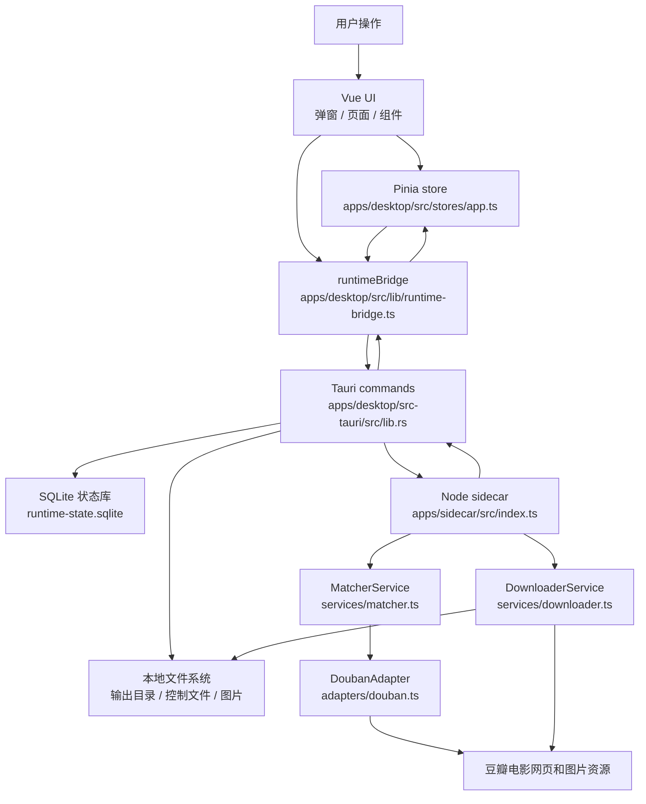

# AI 项目地图

本目录是给 AI 编程工具使用的轻量项目图谱。目标不是替代源码，而是减少每次接手时反复扫描目录、依赖和跨层链路的 Token 消耗。

## 使用方式

复杂任务建议按这个顺序读取：

1. 先读本文，确定项目分层、边界和入口。
2. 按任务类型读取 [runtime-flows.md](./runtime-flows.md) 中对应链路。
3. 再用 [module-index.md](./module-index.md) 定位需要打开的少量源码文件。
4. 修改跨层契约、入口或链路后，按 [maintenance-guide.md](./maintenance-guide.md) 更新本目录。

这份图谱只提供导航。源码、测试、`AGENTS.md`、`README.md` 和 `docs/usage-guide.md` 仍然是事实来源；如果图谱和代码不一致，以当前代码为准，并同步修正文档。

## 当前项目边界

`movie-cover-downloader` 是 Windows 桌面应用，当前真实下载链路只围绕豆瓣电影：

- 前端：Vue 3、TypeScript、Vite、Pinia。
- 桌面能力层：Tauri 2、Rust、SQLite、本地文件系统、sidecar 进程管理。
- 抓取执行层：Node.js sidecar、TypeScript、豆瓣适配器、sharp 图片处理。
- 当前核心对象：搜索影视、自动下载、选图下载、任务队列、Cookie、日志、图片处理、自定义裁剪。

不要把早期规划文档里的 ImpAwards、Playwright 抓取、托盘、自动更新、代理等能力当成已实现功能。

## 总体架构图



## 三层职责

| 层级 | 主要路径 | 职责 | 不应该做 |
| --- | --- | --- | --- |
| 前端 UI/状态 | `apps/desktop/src` | 表单、弹窗、队列状态、Cookie 状态、日志展示、图片处理交互 | 绕过 Tauri 直接读写本地敏感文件；直接执行真实下载 |
| Tauri/Rust | `apps/desktop/src-tauri/src` (模块化) | SQLite、文件系统边界校验、sidecar 启动、stdout/stderr 解析、事件转发 | 在外部输入上 panic；把 Cookie 写进命令行或日志 |
| sidecar | `apps/sidecar/src` | 豆瓣搜索/解析/下载、断点续传、sharp 转换裁剪、结构化事件输出 | 直接操作前端状态；调用 Tauri API |

**Rust 模块化架构**（2026年6月重构）：

- **lib.rs** (857行) - Tauri 应用入口
- **基础模块**: constants, types, utils, crypto, task_control
- **sqlite/**: connection, state, migration
- **sidecar/**: runtime, parser, download, douban
- **commands/**: state, login, task, fs, image

## AI 任务定位速查

| 如果任务是 | 先读 | 通常还要读 |
| --- | --- | --- |
| 搜索影视结果、分页、选图下载入口 | [runtime-flows.md](./runtime-flows.md#搜索影视链路) | `SearchMovieModal.vue`、`runtime-bridge.ts`、`lib.rs`、`douban-search.ts` |
| 添加下载任务、自动下载 | [runtime-flows.md](./runtime-flows.md#自动下载链路) | `CreateTaskModal.vue`、`app.ts`、`runtime-bridge.ts`、`scheduler.ts` |
| 选图下载、滚动分页、框选、多选、预览 | [runtime-flows.md](./runtime-flows.md#选图发现链路) | `CreateTaskModal.vue`、`SelectedPhotoGrid.vue`、`SelectedPhotoPreviewModal.vue`、`douban.ts` |
| 下载队列、暂停/继续/重试/删除 | [runtime-flows.md](./runtime-flows.md#队列和任务控制链路) | `app.ts`、`TaskTable.vue`、`queue-runtime.ts`、`task-control.ts`、`lib.rs` |
| Cookie 导入、冷却、失效处理 | [runtime-flows.md](./runtime-flows.md#cookie-链路) | `ImportCookieModal.vue`、`app.ts`、`cookie-pool.ts`、`lib.rs` |
| SQLite 持久化、状态迁移 | [runtime-flows.md](./runtime-flows.md#持久化链路) | `app.ts`、`types/app.ts`、`lib.rs`、相关 Rust 测试 |
| 图片处理或自定义裁剪 | [runtime-flows.md](./runtime-flows.md#图片处理和自定义裁剪链路) | `ImageProcessModal.vue`、`CustomCropModal.vue`、`runtime-bridge.ts`、`lib.rs` |
| 打包、sidecar resources、安装包 | [module-index.md](./module-index.md#构建和打包) | `package.json`、`apps/desktop/package.json`、`tauri.conf.json`、`scripts/prepare-sidecar-bundle.ps1` |

## 高风险边界

- 选图下载不能恢复 `全部` 分类和 `解析当前分类` 按钮。
- 选图发现必须保持分页/游标式，前端滚动到底部才请求下一批。
- 切换选图分类时取消旧 discovery 是正常流程，不应弹错误警告。
- 用户确认下载选中图片后，应停止后续 discovery，只下载前端传入的 selected images。
- 重复选图任务判定必须包含链接、输出根目录、分类和图片比例。
- 自定义裁剪拖拽本地图片必须走 `readDroppedImageFile(filePath)`，不能重新绑定输出根目录。
- Cookie 不得进入命令行参数或日志。
- 删除/清理本地目录必须走 Rust 边界校验。

## 验证入口

按改动范围选择最小验证：

```bash
pnpm --dir apps/desktop exec vue-tsc --noEmit
pnpm --dir apps/sidecar typecheck
pnpm --dir apps/desktop test
pnpm --dir apps/sidecar test
cd apps/desktop/src-tauri
cargo check
```

文档-only 改动至少检查 Markdown 链接指向的本地文件或章节是否存在。
