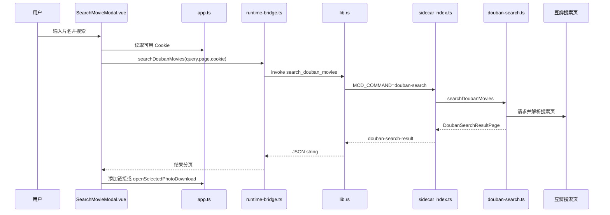
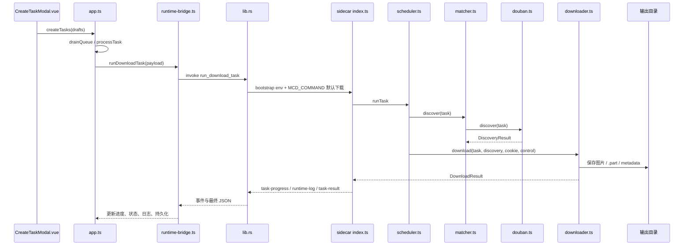
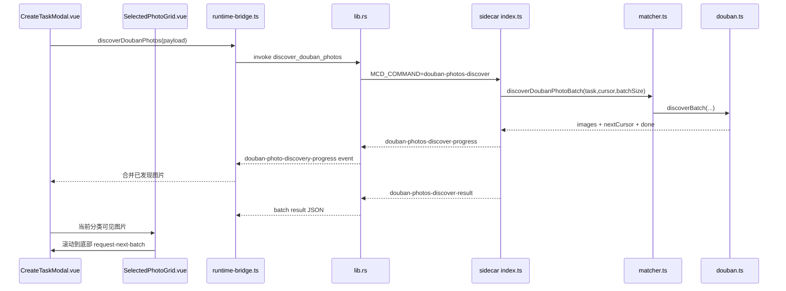
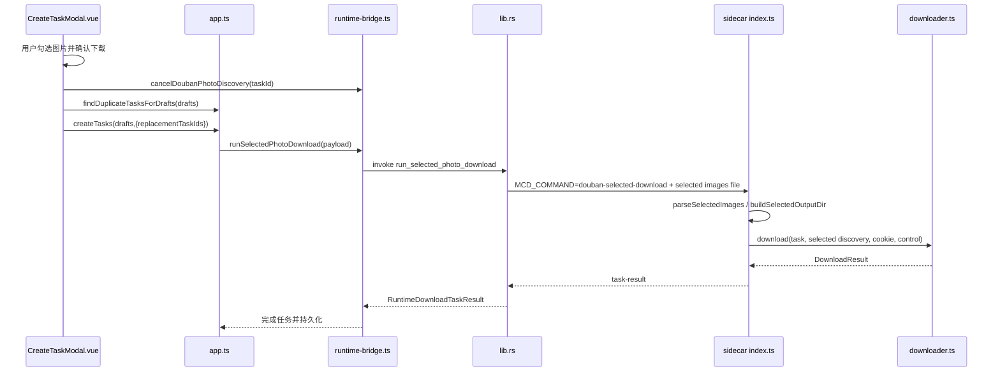
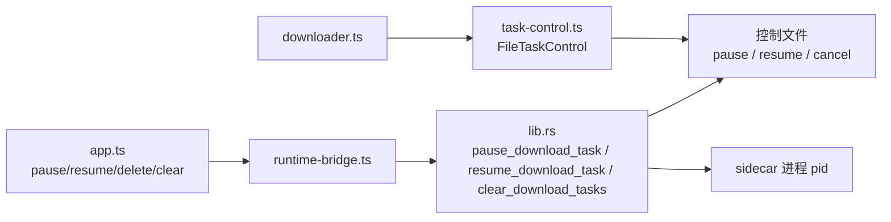
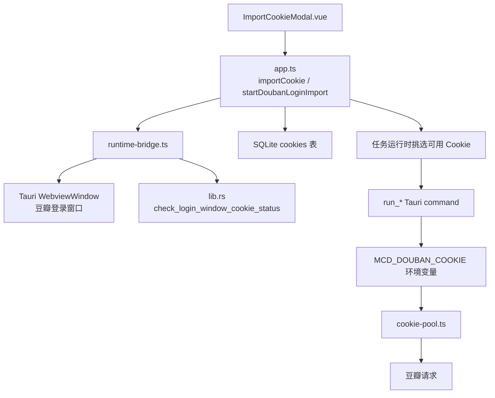
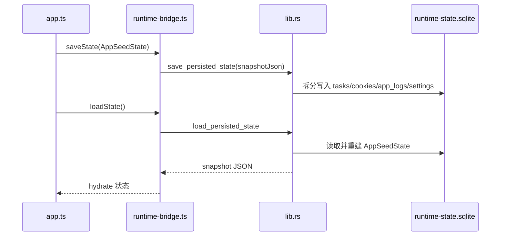
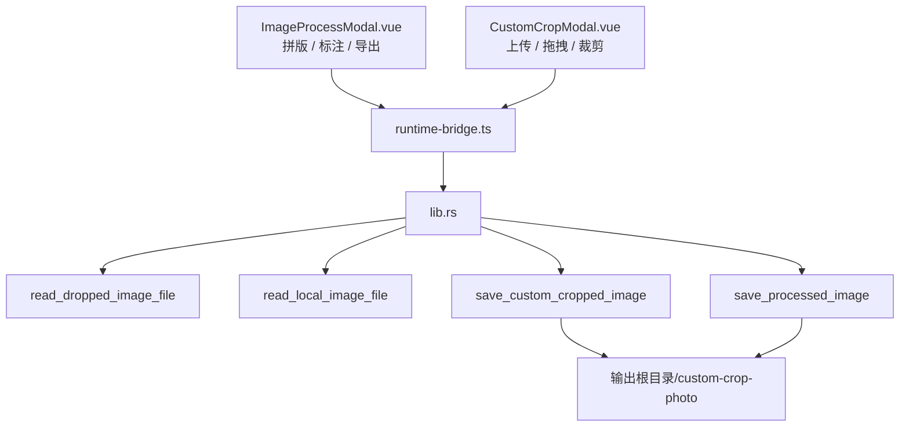

# 运行链路图

本文按业务链路描述跨层调用。AI 排查问题时优先按链路读文件，避免从全仓库目录扫描开始。

## Rust 后端模块化架构

**2026年6月完成重构**，lib.rs 从 3562 行减少到 857 行，按功能分离成独立模块：

- **commands/** - Tauri 命令入口（state, login, task, fs, image）
- **sidecar/** - Sidecar 进程管理（runtime, parser, download, douban）
- **sqlite/** - 数据库操作（connection, state, migration）
- **基础模块** - constants, types, utils, crypto, task_control

各链路中提到的 `lib.rs` 命令现在位于对应的 commands 模块文件中。

## 搜索影视链路

关键文件：

- `apps/desktop/src/components/queue/SearchMovieModal.vue`：搜索输入、页级缓存、结果按钮、可用 Cookie 判断。
- `apps/desktop/src/lib/runtime-bridge.ts`：`searchDoubanMovies`。
- `apps/desktop/src-tauri/src/commands/task.rs`：`search_douban_movies` 命令。
- `apps/desktop/src-tauri/src/sidecar/douban.rs`：`search_douban_movies_blocking` 实现。
- `apps/sidecar/src/index.ts`：`MCD_COMMAND=douban-search`。
- `apps/sidecar/src/services/douban-search.ts`：豆瓣搜索页解析。

注意：搜索结果页已做内存缓存，缓存 key 包含 query 和 page；切换已访问页不应重复请求豆瓣。

## 自动下载链路

关键文件：

- `apps/desktop/src/components/queue/CreateTaskModal.vue`：自动下载表单和 draft 校验。
- `apps/desktop/src/stores/app.ts`：`createTasks`、`drainQueue`、`runNativeTask`、`buildCompletedTask`。
- `apps/desktop/src-tauri/src/commands/task.rs`：`run_download_task` 命令。
- `apps/desktop/src-tauri/src/sidecar/download.rs`：`run_download_task_blocking` 实现。
- `apps/desktop/src-tauri/src/sidecar/parser.rs`：stdout/stderr 解析。
- `apps/sidecar/src/services/scheduler.ts`：任务编排。
- `apps/sidecar/src/services/matcher.ts`：选择站点适配器。
- `apps/sidecar/src/adapters/douban.ts`：豆瓣详情页和图片页解析。
- `apps/sidecar/src/services/downloader.ts`：下载、断点续传、sharp 转换/裁剪、保存文件。

注意：豆瓣任务在前端队列层会串行保护，请求间隔会进入真实抓取链路。

## 选图发现链路

关键状态在 `CreateTaskModal.vue`：

- `selectedPhotoFilter`：当前分类，只能是 `still | poster | wallpaper`。
- `selectedPhotoDiscoveryByAsset`：每个分类的 cursor/done。
- `selectedPhotoVisibleLimit`：前端当前展示数量。
- `selectedPhotoGridLoadingRequested`：滚动到底部后请求下一批。
- `selectedDiscoveryTaskId`：当前 discovery task id，用于取消。
- `selectedPhotoLoadedUrls` / `selectedPhotoFailedUrls`：缩略图 loading 和失败占位。

注意：

- 不要一次性解析全部分类或全部页面。
- 空分类应显示空状态，不能卡在 loading。
- 切换分类要停止旧 discovery，再优先解析新分类。

## 选图下载链路

重复任务检测在 `app.ts` 的 `findDuplicateTasksForDrafts` 和 `createTasks` 附近；覆盖确认 UI 在 `CreateTaskModal.vue`。

## 队列和任务控制链路

关键点：

- 前端入口要做 UI 禁用和 store 入口二次保护。
- sidecar 在安全点读取控制文件，暂停保留当前 `.part`。
- 删除或清空队列时，Rust 负责取消可能仍在运行的 sidecar 进程。

## Cookie 链路

安全约束：

- Cookie 不写命令行参数。
- Cookie 不写日志。
- SQLite 中 Cookie 会走保护/兼容处理。
- 登录失效、风控页、典型反爬错误会触发 Cookie 冷却；空分类不应让 Cookie 冷却。

## 持久化链路

涉及持久化字段时要同时检查：

- `apps/desktop/src/types/app.ts`
- `apps/desktop/src/stores/app.ts`
- `apps/desktop/src-tauri/src/lib.rs`
- `apps/desktop/src/test/stores/app.test.ts`
- `apps/desktop/src-tauri/src/lib.rs` 中 SQLite 相关 Rust 测试

## 图片处理和自定义裁剪链路

注意：

- 自定义裁剪的 Tauri 拖拽读取必须走 `readDroppedImageFile(filePath)`，不绑定输出根目录。
- `readLocalImageFile(filePath, outputRootDir)` 仍用于需要输出根目录边界校验的读取场景。
- 保存裁剪结果固定写入输出根目录下的 `custom-crop-photo`。
