# 运行链路图

本文按业务链路描述跨层调用。AI 排查问题时优先按链路读文件，避免从全仓库目录扫描开始。

## Rust 后端模块化架构

**2026年6月完成重构**，lib.rs 从 3562 行减少到 857 行，按功能分离成独立模块：

- **commands/** - Tauri 命令入口（state, login, task, fs, image）
- **sidecar/** - Sidecar 进程管理（runtime, parser, download, douban）
- **sqlite/** - 数据库操作（connection, state, migration）
- **基础模块** - constants, types, utils, crypto, task_control

各链路中提到的 `lib.rs` 命令现在位于对应的 commands 模块文件中。

## 前端 Store 拆分结构

最近的 Store 重构后，`apps/desktop/src/stores/app.ts` 不再承载全部领域逻辑，而是主协调层：

- `app.ts`：启动恢复、持久化调度、组合子 store 与任务动作。
- `taskQueue.ts`：任务队列、运行状态、重复任务检测、队列配置。
- `taskActions.ts`：创建、暂停、继续、重试、删除、清空、打开输出目录等任务动作。
- `cookies.ts`：Cookie 导入、可用性、冷却、失效。
- `logs.ts`：运行日志。
- `ui.ts`：弹窗开关、输出目录、全局提示。
- `movieDetails.ts`：详情弹窗、500ms 防抖、内存缓存、在途请求复用、最后请求生效和重试。
- `app-helpers.ts`：状态快照、任务恢复、持久化错误提示。

排查 store 问题时先判断领域，再打开对应文件；不要默认把逻辑加回 `app.ts`。

## 搜索影视链路

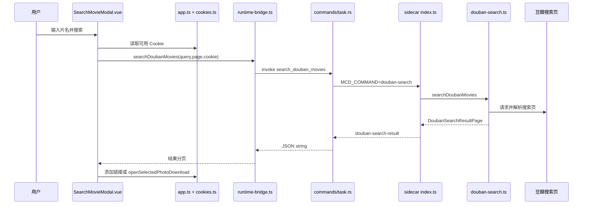
```mermaid
sequenceDiagram
  participant User as 用户
  participant Search as SearchMovieModal.vue
  participant Store as app.ts + cookies.ts
  participant Bridge as runtime-bridge.ts
  participant Tauri as commands/task.rs
  participant Sidecar as sidecar index.ts
  participant SearchSvc as douban-search.ts
  participant Douban as 豆瓣搜索页

  User->>Search: 输入片名并搜索
  Search->>Store: 读取可用 Cookie
  Search->>Bridge: searchDoubanMovies(query,page,cookie)
  Bridge->>Tauri: invoke search_douban_movies
  Tauri->>Sidecar: MCD_COMMAND=douban-search
  Sidecar->>SearchSvc: searchDoubanMovies
  SearchSvc->>Douban: 请求并解析搜索页
  SearchSvc-->>Sidecar: DoubanSearchResultPage
  Sidecar-->>Tauri: douban-search-result
  Tauri-->>Bridge: JSON string
  Bridge-->>Search: 结果分页
  Search->>Store: 添加链接或 openSelectedPhotoDownload
```

关键文件：

- `apps/desktop/src/components/queue/SearchMovieModal.vue`：搜索输入、页级缓存、结果按钮、可用 Cookie 判断。
- `apps/desktop/src/lib/runtime-bridge.ts`：`searchDoubanMovies`。
- `apps/desktop/src-tauri/src/commands/task.rs`：`search_douban_movies` 命令。
- `apps/desktop/src-tauri/src/sidecar/douban.rs`：`search_douban_movies_blocking` 实现。
- `apps/sidecar/src/index.ts`：`MCD_COMMAND=douban-search`。
- `apps/sidecar/src/services/douban-search.ts`：豆瓣搜索页解析。

注意：搜索结果页已做内存缓存，缓存 key 包含 query 和 page；切换已访问页不应重复请求豆瓣。

## 影片详情链路

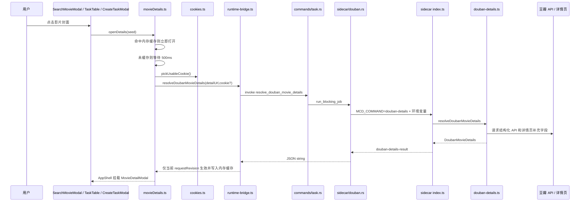
```mermaid
sequenceDiagram
  participant User as 用户
  participant Entry as SearchMovieModal / TaskTable / CreateTaskModal
  participant Store as movieDetails.ts
  participant Cookies as cookies.ts
  participant Bridge as runtime-bridge.ts
  participant Tauri as commands/task.rs
  participant RustSidecar as sidecar/douban.rs
  participant Sidecar as sidecar index.ts
  participant DetailService as douban-details.ts
  participant Douban as 豆瓣 API / 详情页

  User->>Entry: 点击影片封面
  Entry->>Store: openDetails(seed)
  Store->>Store: 命中内存缓存则立即打开
  Store->>Store: 未缓存则等待 500ms
  Store->>Cookies: pickUsableCookie()
  Store->>Bridge: resolveDoubanMovieDetails(detailUrl,cookie?)
  Bridge->>Tauri: invoke resolve_douban_movie_details
  Tauri->>RustSidecar: run_blocking_job
  RustSidecar->>Sidecar: MCD_COMMAND=douban-details + 环境变量
  Sidecar->>DetailService: resolveDoubanMovieDetails
  DetailService->>Douban: 请求结构化 API 和详情页补充字段
  DetailService-->>Sidecar: DoubanMovieDetails
  Sidecar-->>RustSidecar: douban-details-result
  RustSidecar-->>Bridge: JSON string
  Bridge-->>Store: 仅当前 requestRevision 生效并写入内存缓存
  Store-->>Entry: AppShell 挂载 MovieDetailModal
```

关键文件：

- `apps/desktop/src/stores/movieDetails.ts`：500ms 防抖、运行期缓存、同 URL 在途请求复用、旧响应丢弃和错误提示。
- `apps/desktop/src/components/queue/movie-details/MovieDetailModal.vue`：详情字段、主演折叠、评分、简介复制、关闭和重试。
- `apps/desktop/src/lib/runtime-bridge.ts`：`resolveDoubanMovieDetails`。
- `apps/desktop/src-tauri/src/commands/task.rs`：`resolve_douban_movie_details` 命令。
- `apps/desktop/src-tauri/src/sidecar/douban.rs`：以隐藏窗口方式启动详情 sidecar，并透传可选 Cookie 环境变量。
- `apps/sidecar/src/services/douban-details.ts`：校验豆瓣 subject URL，合并结构化 API 与 HTML 补充字段。

注意：详情缓存不持久化。无 Cookie 时允许匿名尝试；URL 只允许 `https://movie.douban.com/subject/<id>/`，结构化 API 的手动重定向只允许同一 subject ID 从 movie 切换到 tv，不能放宽为任意跳转。

## 自动下载链路

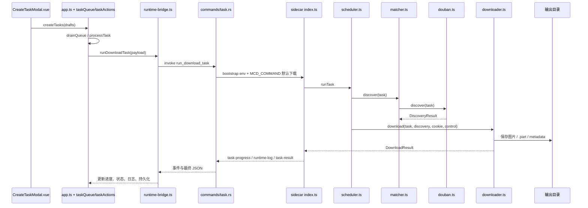
```mermaid
sequenceDiagram
  participant Modal as CreateTaskModal.vue
  participant Store as app.ts + taskQueue/taskActions
  participant Bridge as runtime-bridge.ts
  participant Tauri as commands/task.rs
  participant Sidecar as sidecar index.ts
  participant Scheduler as scheduler.ts
  participant Matcher as matcher.ts
  participant DoubanAdapter as douban.ts
  participant Downloader as downloader.ts
  participant FS as 输出目录

  Modal->>Store: createTasks(drafts)
  Store->>Store: drainQueue / processTask
  Store->>Bridge: runDownloadTask(payload)
  Bridge->>Tauri: invoke run_download_task
  Tauri->>Sidecar: bootstrap env + MCD_COMMAND 默认下载
  Sidecar->>Scheduler: runTask
  Scheduler->>Matcher: discover(task)
  Matcher->>DoubanAdapter: discover(task)
  DoubanAdapter-->>Matcher: DiscoveryResult
  Scheduler->>Downloader: download(task, discovery, cookie, control)
  Downloader->>FS: 保存图片 / .part / metadata
  Downloader-->>Sidecar: DownloadResult
  Sidecar-->>Tauri: task-progress / runtime-log / task-result
  Tauri-->>Bridge: 事件与最终 JSON
  Bridge-->>Store: 更新进度、状态、日志、持久化
```

关键文件：

- `apps/desktop/src/components/queue/CreateTaskModal.vue`：自动下载表单和 draft 校验。
- `apps/desktop/src/stores/app.ts`：组合子 store、启动恢复、持久化调度。
- `apps/desktop/src/stores/taskQueue.ts`：队列状态、调度运行状态、重复任务检测。
- `apps/desktop/src/stores/taskActions.ts`：`createTasks`、`retryTask`、`pauseTask`、`resumeTask`、`deleteTask`、`clearQueueTasks` 等动作。
- `apps/desktop/src-tauri/src/commands/task.rs`：`run_download_task` 命令。
- `apps/desktop/src-tauri/src/sidecar/download.rs`：`run_download_task_blocking` 实现。
- `apps/desktop/src-tauri/src/sidecar/parser.rs`：stdout/stderr 解析。
- `apps/sidecar/src/services/scheduler.ts`：任务编排。
- `apps/sidecar/src/services/matcher.ts`：选择站点适配器。
- `apps/sidecar/src/adapters/douban.ts`：豆瓣详情页和图片页解析。
- `apps/sidecar/src/services/downloader.ts`：下载、断点续传、sharp 转换/裁剪、保存文件。

注意：豆瓣任务在前端队列层会串行保护，请求间隔会进入真实抓取链路。

### 下载队列封面补全

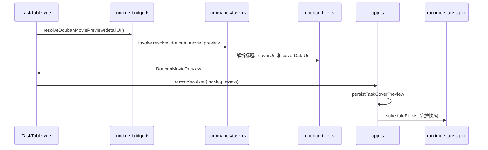
```mermaid
sequenceDiagram
  participant Table as TaskTable.vue
  participant Bridge as runtime-bridge.ts
  participant Tauri as commands/task.rs
  participant Sidecar as douban-title.ts
  participant App as app.ts
  participant SQLite as runtime-state.sqlite

  Table->>Bridge: resolveDoubanMoviePreview(detailUrl)
  Bridge->>Tauri: invoke resolve_douban_movie_preview
  Tauri->>Sidecar: 解析标题、coverUrl 和 coverDataUrl
  Sidecar-->>Table: DoubanMoviePreview
  Table->>App: coverResolved(taskId,preview)
  App->>App: persistTaskCoverPreview
  App->>SQLite: schedulePersist 完整快照
```

创建任务时，`taskActions.ts` 会先规范化豆瓣详情 URL 再匹配预览缓存；队列表格优先显示 `coverDataUrl`，其次才使用远程 `coverUrl`。封面解析失败只保留占位，不影响下载任务。

## 选图发现链路

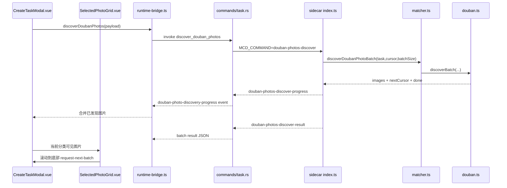
```mermaid
sequenceDiagram
  participant Modal as CreateTaskModal.vue
  participant Grid as SelectedPhotoGrid.vue
  participant Bridge as runtime-bridge.ts
  participant Tauri as commands/task.rs
  participant Sidecar as sidecar index.ts
  participant Matcher as matcher.ts
  participant DoubanAdapter as douban.ts

  Modal->>Bridge: discoverDoubanPhotos(payload)
  Bridge->>Tauri: invoke discover_douban_photos
  Tauri->>Sidecar: MCD_COMMAND=douban-photos-discover
  Sidecar->>Matcher: discoverDoubanPhotoBatch(task,cursor,batchSize)
  Matcher->>DoubanAdapter: discoverBatch(...)
  DoubanAdapter-->>Sidecar: images + nextCursor + done
  Sidecar-->>Tauri: douban-photos-discover-progress
  Tauri-->>Bridge: douban-photo-discovery-progress event
  Bridge-->>Modal: 合并已发现图片
  Sidecar-->>Tauri: douban-photos-discover-result
  Tauri-->>Bridge: batch result JSON
  Modal->>Grid: 当前分类可见图片
  Grid->>Modal: 滚动到底部 request-next-batch
```

关键状态在 `CreateTaskModal.vue`：

- `selectedPhotoFilter`：当前分类，只能是 `still | poster | wallpaper`。
- `selectedPhotoDiscoveryByAsset`：每个分类的 cursor/done。
- `selectedPhotoVisibleLimit`：前端当前展示数量。
- `selectedPhotoGridLoadingRequested`：滚动到底部后请求下一批。
- `selectedDiscoveryTaskId`：当前 discovery task id，用于取消。
- `selectedPhotoLoadedUrls` / `selectedPhotoFailedUrls`：缩略图 loading 和失败占位。

注意：

- 不要一次性解析全部分类或全部页面。
- `nextCursor` / `totalCount` 允许缺失；分类总数解析要兼容 HTML 实体以及中英文千位分隔符。
- 空分类应在 discovery 完成且当前分类没有已发现或待合并图片时显示，不能提前报空或卡在 loading。
- 切换分类要停止旧 discovery，再优先解析新分类。

## 选图下载链路

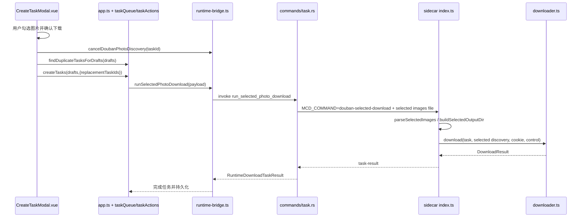
```mermaid
sequenceDiagram
  participant Modal as CreateTaskModal.vue
  participant Store as app.ts + taskQueue/taskActions
  participant Bridge as runtime-bridge.ts
  participant Tauri as commands/task.rs
  participant Sidecar as sidecar index.ts
  participant Downloader as downloader.ts

  Modal->>Modal: 用户勾选图片并确认下载
  Modal->>Bridge: cancelDoubanPhotoDiscovery(taskId)
  Modal->>Store: findDuplicateTasksForDrafts(drafts)
  Modal->>Store: createTasks(drafts,{replacementTaskIds})
  Store->>Bridge: runSelectedPhotoDownload(payload)
  Bridge->>Tauri: invoke run_selected_photo_download
  Tauri->>Sidecar: MCD_COMMAND=douban-selected-download + selected images file
  Sidecar->>Sidecar: parseSelectedImages / buildSelectedOutputDir
  Sidecar->>Downloader: download(task, selected discovery, cookie, control)
  Downloader-->>Sidecar: DownloadResult
  Sidecar-->>Tauri: task-result
  Tauri-->>Bridge: RuntimeDownloadTaskResult
  Bridge-->>Store: 完成任务并持久化
```

重复任务检测在 `taskQueue.ts` 的 `findDuplicateTasksForDrafts` 附近；创建/替换任务动作在 `taskActions.ts`；覆盖确认 UI 在 `CreateTaskModal.vue`。

## 队列和任务控制链路

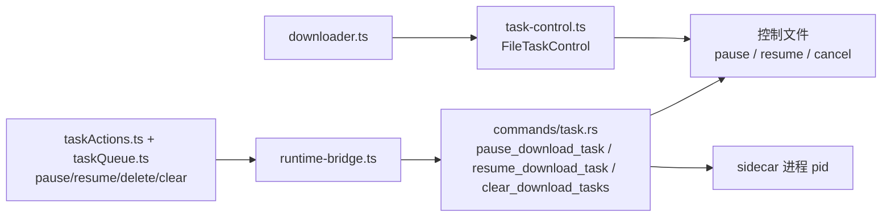
```mermaid
flowchart LR
  Store["taskActions.ts + taskQueue.ts\npause/resume/delete/clear"] --> Bridge["runtime-bridge.ts"]
  Bridge --> Tauri["commands/task.rs\npause_download_task / resume_download_task / clear_download_tasks"]
  Tauri --> Control["控制文件\npause / resume / cancel"]
  Tauri --> Process["sidecar 进程 pid"]
  Sidecar["task-control.ts\nFileTaskControl"] --> Control
  Downloader["downloader.ts"] --> Sidecar
```

关键点：

- 前端入口要做 UI 禁用和 store 入口二次保护。
- sidecar 在安全点读取控制文件，暂停保留当前 `.part`。
- 删除或清空队列时，Rust 负责取消可能仍在运行的 sidecar 进程。

## Cookie 链路

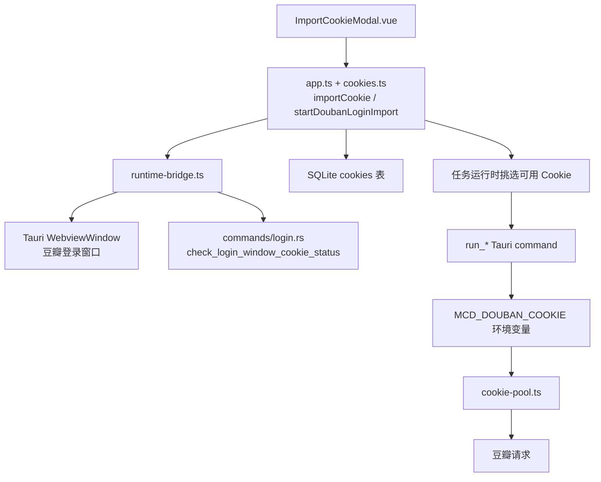
```mermaid
flowchart TB
  Import["ImportCookieModal.vue"] --> Store["app.ts + cookies.ts\nimportCookie / startDoubanLoginImport"]
  Store --> Bridge["runtime-bridge.ts"]
  Bridge --> Login["Tauri WebviewWindow\n豆瓣登录窗口"]
  Bridge --> Tauri["commands/login.rs\ncheck_login_window_cookie_status"]
  Store --> SQLite["SQLite cookies 表"]
  Store --> Task["任务运行时挑选可用 Cookie"]
  Task --> TauriRun["run_* Tauri command"]
  TauriRun --> SidecarEnv["MCD_DOUBAN_COOKIE 环境变量"]
  SidecarEnv --> CookiePool["cookie-pool.ts"]
  CookiePool --> Douban["豆瓣请求"]
```

安全约束：

- Cookie 不写命令行参数。
- Cookie 不写日志。
- SQLite 中 Cookie 会走保护/兼容处理。
- 登录失效、风控页、典型反爬错误会触发 Cookie 冷却；空分类不应让 Cookie 冷却。

## 持久化链路

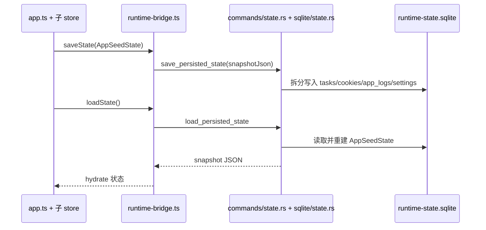
```mermaid
sequenceDiagram
  participant Store as app.ts + 子 store
  participant Bridge as runtime-bridge.ts
  participant Tauri as commands/state.rs + sqlite/state.rs
  participant SQLite as runtime-state.sqlite

  Store->>Bridge: saveState(AppSeedState)
  Bridge->>Tauri: save_persisted_state(snapshotJson)
  Tauri->>SQLite: 拆分写入 tasks/cookies/app_logs/settings
  Store->>Bridge: loadState()
  Bridge->>Tauri: load_persisted_state
  Tauri->>SQLite: 读取并重建 AppSeedState
  Tauri-->>Bridge: snapshot JSON
  Bridge-->>Store: hydrate 状态
```

涉及持久化字段时要同时检查：

- `apps/desktop/src/types/app.ts`
- `apps/desktop/src/stores/app.ts`
- `apps/desktop/src/stores/app-helpers.ts`
- `apps/desktop/src/stores/taskQueue.ts`、`cookies.ts`、`logs.ts`、`ui.ts` 中相关字段
- `apps/desktop/src-tauri/src/sqlite/state.rs`
- `apps/desktop/src/stores/__tests__/app.spec.ts`
- 对应子 store 的 `apps/desktop/src/stores/__tests__/*.spec.ts`
- `apps/desktop/src-tauri/src/lib.rs` 中 SQLite 相关 Rust 测试

## 图片处理和自定义裁剪链路

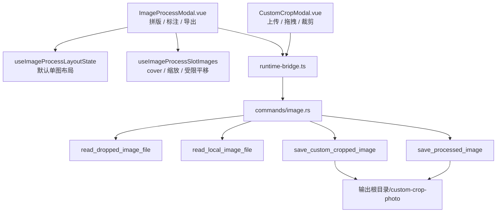
```mermaid
flowchart TB
  ImageProcess["ImageProcessModal.vue\n拼版 / 标注 / 导出"] --> Layout["useImageProcessLayoutState\n默认单图布局"]
  ImageProcess --> Placement["useImageProcessSlotImages\ncover / 缩放 / 受限平移"]
  ImageProcess --> Bridge["runtime-bridge.ts"]
  CustomCrop["CustomCropModal.vue\n上传 / 拖拽 / 裁剪"] --> Bridge
  Bridge --> Tauri["commands/image.rs"]
  Tauri --> ReadDropped["read_dropped_image_file"]
  Tauri --> ReadLocal["read_local_image_file"]
  Tauri --> SaveCustom["save_custom_cropped_image"]
  Tauri --> SaveProcessed["save_processed_image"]
  SaveCustom --> FS["输出根目录/custom-crop-photo"]
  SaveProcessed --> FS
```

注意：

- 自定义裁剪的 Tauri 拖拽读取必须走 `readDroppedImageFile(filePath)`，不绑定输出根目录。
- `readLocalImageFile(filePath, outputRootDir)` 仍用于需要输出根目录边界校验的读取场景。
- 保存裁剪结果固定写入输出根目录下的 `custom-crop-photo`。
- `useImageProcessLayoutState.ts` 默认选择 `q1-full` 单图布局；格子固定，图片始终以 cover 基准覆盖格子。
- `useImageProcessSlotImages.ts` 把缩放限制在 `1-3`，只有当前选中且 scale > 1 的图片可平移；偏移量按图片超出格子的范围归一化并夹紧，预览和 Canvas 导出共用同一 placement 计算。

## 打包和 sidecar resources 链路

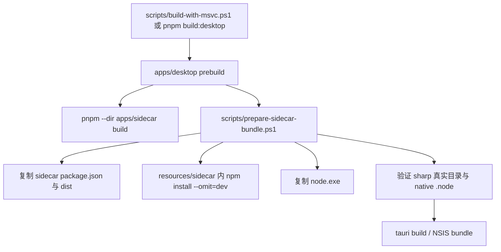
```mermaid
flowchart TB
  Build["scripts/build-with-msvc.ps1 或 pnpm build:desktop"] --> DesktopPrebuild["apps/desktop prebuild"]
  DesktopPrebuild --> SidecarBuild["pnpm --dir apps/sidecar build"]
  DesktopPrebuild --> Prepare["scripts/prepare-sidecar-bundle.ps1"]
  Prepare --> CopyDist["复制 sidecar package.json 与 dist"]
  Prepare --> NpmInstall["resources/sidecar 内 npm install --omit=dev"]
  Prepare --> CopyNode["复制 node.exe"]
  Prepare --> VerifySharp["验证 sharp 真实目录与 native .node"]
  VerifySharp --> TauriBundle["tauri build / NSIS bundle"]
```

关键点：

- `prepare-sidecar-bundle.ps1` 必须在 `apps/desktop/src-tauri/resources/sidecar` 内安装生产依赖，确保 `node_modules` 是真实目录。
- 不要直接复制 pnpm workspace 的 `node_modules`，否则 pnpm junction/symlink 可能被打进安装包，导致用户机器上找不到依赖。
- 打包后检查 `resources/sidecar` 中链接数量为 0，并用打包资源里的 `node.exe -e "require('sharp')"` 验证 sharp 可加载。
